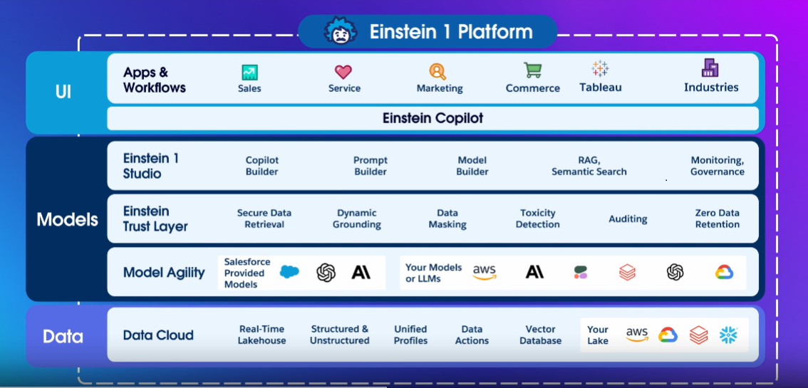

# Salesforce Certified AI Specialist (Summer 24)

### Exam Topic
Identify the security, privacy, and grounding features of the Einstein Trust Layer

### Key Concepts
1. **Data Governance**: The Einstein trust layer is the "Watchdog" of the data. Any models or apps that reach for the data have to go through the trust layer. 
2. **Dynamic Grounding**: The injection/binding of customer data into a prompt before it is sent to the LLM.
3. **Data Masking**: The obfuscation of sensitive data after it is grounded to the prompt before it is sent to the LLM.
4. **Data Demasking**: The reverse of data masking. Once the LLM responds, this process puts the sensitive data back so that the end user has a seamless experience.
5. **Zero Data Retention**: After the LLM has processed a prompt, and data referenced won't be stored by the LLM provider.
6. **Toxicity Detection**: After a response is returned from an LLM, the Salesforce Trust Layer assigns a toxicity score to the response. 

### Key Mechanisms
1. **Einstein Trust Layer**: Setup > Einstein > Einstein Generative AI > Einstein Trust Layer
2. **Einstein Feedback**: Setup > Einstein > Einstein Generative AI > Einstein Feeback

### Details

The Einstein Trust Layer is a security and governance framework in Salesforce that ensures the responsible, ethical, and transparent use of artificial intelligence (AI) in the platform's products, especially those powered by Salesforce Einstein (Salesforce’s AI technology). It acts as a safeguard to build trust in the AI-powered features by protecting data privacy, enforcing ethical AI practices, and ensuring compliance with industry standards.

## <u>A couple images that show the same conceptual view of how the trust layer fits into the platform</u>

 

 

## <u>A couple images that show the same conceptual view of the trust layer</u>

 

Via the Einstein Feedback tool, you can audit or monitor prompts and prompt responses.
You also have the ability to report on prompts and prompt responses.
Prompt request/reply info is stored for 30 days.
Analytics Studio contains dashboards of AI usage.

Super important takeaways of the trust layer:
1. It prevents LLMs from seeing sensitive data.
2. It prohibits LLMs and providers from monitoring or retaining your data.
3. It helps you monitor content for safety.

### Resources
- [Trailhead - The Einstein Trust Layer](https://trailhead.salesforce.com/content/learn/modules/the-einstein-trust-layer?trail_id=drive-productivity-with-einstein-ai)
- [Trailhead - LLM Basics ](https://trailhead.salesforce.com/content/learn/modules/large-language-models)

**Next Section**: [Next](./1.2.md) 
**Main**: [Main](../README.md)